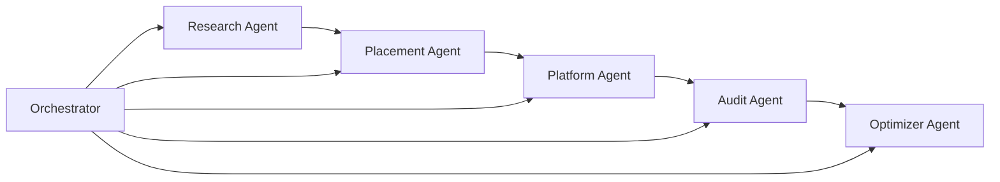

# Pharma Sales Rep Platform

## Demo

Watch a walkthrough of discovery placement clinical Q and A and brand visibility audit in action.

[Play the 90 second trailer](https://github.com/alexandracollinsss/Phara-Sales-Rep-Agents/blob/main/docs/demo-trailer.mp4)

[Download the full demo](https://github.com/alexandracollinsss/Phara-Sales-Rep-Agents/releases/download/demo-assets/demo.mp4)

## Opportunity

Physician facing AI tools are becoming a daily research surface for clinicians. Brands that do not show up in those answers lose mindshare even when the clinical evidence is strong. This program builds a digital pharma sales rep that helps a company understand how its GLP 1 therapies appear in an evidence style Q and A experience then improves that visibility with measurable audit loops.

Initial delivery focuses on GLP 1 therapies because the public evidence base is rich enough to support a credible demo. The same operating model can expand to other therapeutic areas later.

## Program outcomes

1. Discover a company therapy set from public sources and curated GLP 1 evidence.
2. Prioritize featured therapies inside a local physician Q and A platform that answers with citations.
3. Audit brand visibility against competitors across a fixed clinical prompt battery.
4. Recommend content and placement changes from the gaps the audit finds.
5. Surface visibility trends over time on a simple dashboard.

## Delivery model

The system is a coordinated multi agent workflow. An orchestrator runs research placement platform audit and optimization as one end to end loop so stakeholders can go from company name to visibility insight without stitching tools by hand.



| Agent | Accountability |
| --- | --- |
| Research | Finds company drugs through openFDA and curated GLP 1 data |
| Placement | Applies ranked featured therapies in retrieval |
| Platform | Runs physician Q and A with citations using Ollama and the corpus |
| Audit | Runs eight clinical prompts and scores brand versus competitor mentions |
| Optimizer | Turns audit gaps into content and placement recommendations |
| Orchestrator | Owns the full workflow sequence |

## Repository layout

```
├── config/clients/       Client profile competitors and Ollama model
├── data/corpus/          Clinical evidence markdown for key trials
├── prompts/              Audit prompt battery
├── docs/                 Demo video and program artifacts
├── src/
│   ├── agents/           Specialized agents and orchestrator
│   ├── audit/            Scoring and SQLite dashboard store
│   ├── platform/         RAG placement and Open Evidence style app
│   ├── research/         openFDA company drug discovery
│   └── web/              FastAPI app
├── web/                  HTML CSS JS UI
└── scripts/              Tests and share helper
```

## What you need before kickoff

1. Python 3.9 or newer
2. [Ollama](https://ollama.com) with llama3.2 pulled

## Getting started

```bash
git clone https://github.com/alexandracollinsss/Phara-Sales-Rep-Agents.git
cd Phara-Sales-Rep-Agents

python3 -m venv .venv
source .venv/bin/activate
pip install -r requirements.txt

ollama pull llama3.2
python -m src.cli test
python -m src.cli serve
```

Platform URL is http://127.0.0.1:8080/ Enter a company choose Discover drugs and apply then ask clinical questions.

Dashboard URL is http://127.0.0.1:8080/dashboard Use it to review visibility metrics over time.

Public share URL for demos is https://savannah-ends-fare-course.trycloudflare.com

That public link works only while `python -m src.cli share` is running on the host machine. A new URL is printed each time you start the tunnel.

## Access strategy for reviewers

This app depends on Ollama running on the same machine as the FastAPI service. Chat and audits both use llama3.2. That constraint shaped the decision to expose the demo with Cloudflare Tunnel rather than a cloud VM.

| Dimension | Cloudflare Tunnel on a local machine | DigitalOcean Droplet |
| --- | --- | --- |
| Cost | Free for a quick tunnel with no server bill | Paid VM often about 24 to 48 USD per month for 4 to 8 GB RAM |
| Ollama | Runs on your Mac as designed | Must install and operate Ollama on the VM |
| Setup effort | Minutes for the app plus cloudflared | SSH nginx firewall systemd and model pull |
| Fit for this repo | Works with zero code changes | Better when you want always on hosting |

A Droplet is the right longer term choice when the app must stay online without a laptop. Free PaaS hosts such as Render Railway or Vercel usually run only the Python app. They do not provide Ollama so chat and audits would fail unless the app points at a separate LLM API or another machine.

DigitalOcean student credits were requested through GitHub Student benefits before shipping. The activation email never arrived including quarantine and spam so the credits were never applied. Without that credit a Droplet would have been paid hosting on short notice. Cloudflare Tunnel was the practical path. It is free has no account billing and keeps local Ollama unchanged.

Cloudflare Tunnel forwards traffic to http://127.0.0.1:8080 on your machine while Ollama stays local. Reviewers get a public https link while the tunnel process is running. The computer must stay on and connected.

```bash
brew install cloudflared
ollama serve
python -m src.cli share
```

Current tunnel URL is https://savannah-ends-fare-course.trycloudflare.com

Copy the https trycloudflare.com URL from the terminal if you start a new tunnel. Keep that terminal open while the tunnel is active.

Manual two terminal option

```bash
# Terminal 1
python -m src.cli serve --no-reload

# Terminal 2
cloudflared tunnel --url http://127.0.0.1:8080
```

## Operator commands

```bash
python -m src.cli agents
python -m src.cli discover "Eli Lilly"
python -m src.cli ask "Compare tirzepatide vs semaglutide?" --company "Eli Lilly"
python -m src.cli audit --save
python -m src.cli run
python -m src.cli test --full
```

## Selected API surface

| Endpoint | Purpose |
| --- | --- |
| `GET /api/health` | Ollama status corpus and placement |
| `GET /api/agents` | Agent roster |
| `POST /api/company/discover` | Research finds drugs and applies placement |
| `POST /api/placement/clear` | Reset placement for an empty company |
| `POST /api/ask/stream` | Streaming clinical Q and A |
| `POST /api/audit/run` | Run the eight prompt audit and save |
| `GET /api/audit/history` | Dashboard time series |

## Data handling and privacy

1. Drug discovery uses the public openFDA API. Results are cached under `data/companies/` and that path is gitignored.
2. Placement state lives under `data/placement/` and is gitignored.
3. Audit and chat metrics use local SQLite at `data/audits.db` and that file is gitignored.
4. No API keys are required for the default local setup.
