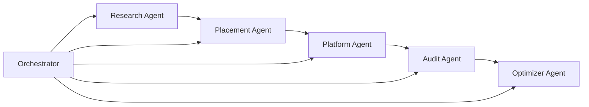

# Pharma Sales Rep Platform

A multi agent system that acts as a **digital pharma sales rep** for physician facing AI. It discovers a company's GLP-1 therapies, prioritizes them in an Open Evidence style Q&A platform (local LLM + RAG), audits brand visibility against competitors, and recommends optimizations.

**Initial scope.** GLP 1 therapies (rich public evidence base). The architecture supports other therapeutic areas later.

## Architecture



| Agent | Role |
|-------|------|
| **Research** | Discovers company drugs via openFDA + curated GLP 1 data |
| **Placement** | Applies ranked “featured therapies” in RAG retrieval |
| **Platform** | Physician Q&A with citations (Ollama + corpus) |
| **Audit** | Runs 8 clinical prompts and scores brand vs competitor mentions |
| **Optimizer** | Content and placement recommendations from audit gaps |
| **Orchestrator** | Coordinates the full workflow |

## Project structure

```
├── config/clients/       # Client profile (competitors, Ollama model)
├── data/corpus/          # Clinical evidence markdown (SURPASS, SURMOUNT, SELECT, …)
├── prompts/              # Audit prompt battery
├── src/
│   ├── agents/           # Specialized agents + orchestrator
│   ├── audit/            # Scoring + SQLite dashboard store
│   ├── platform/         # RAG, placement, Open Evidence clone
│   ├── research/         # openFDA company drug discovery
│   └── web/              # FastAPI app
├── web/                  # HTML/CSS/JS UI
└── scripts/              # Tests and share helper
```

## Prerequisites

- **Python 3.9+**
- **[Ollama](https://ollama.com)** with `llama3.2` pulled

## Quick start

```bash
git clone https://github.com/alexandracollinsss/Phara-Sales-Rep-Agents.git
cd Phara-Sales-Rep-Agents

python3 -m venv .venv
source .venv/bin/activate
pip install -r requirements.txt

ollama pull llama3.2
python -m src.cli test
python -m src.cli serve
```

**Platform.** http://127.0.0.1:8080/ Enter a company, click **Discover drugs & apply**, then ask questions.

**Dashboard.** http://127.0.0.1:8080/dashboard Visibility metrics over time.

**Public URL (Cloudflare).** https://savannah-ends-fare-course.trycloudflare.com

This link works only while `python -m src.cli share` is running on the host machine. A new URL is printed each time you start the tunnel.

## Cloudflare Tunnel

This app depends on **Ollama running on the same machine** as the FastAPI service (`llama3.2` for chat and audits). That shapes how you expose it on the internet.

**Why Cloudflare Tunnel instead of a cloud VM (e.g. DigitalOcean)?**

| | Cloudflare Tunnel + local machine | DigitalOcean Droplet |
|---|-----------------------------------|----------------------|
| **Cost** | Free (quick tunnel, no server bill) | Paid VM (~$24 to $48/mo for 4 to 8 GB RAM) |
| **Ollama** | Runs on your Mac as designed | Must install and operate Ollama on the VM |
| **Setup** | Minutes (app + `cloudflared`) | SSH, nginx, firewall, systemd, model pull |
| **Fit for this repo** | Works with zero code changes | Valid for 24/7 hosting when you want an always on server |

A **Droplet** is the right long term choice when you need the app online without your laptop. Free **PaaS** hosts (Render, Railway, Vercel, etc.) typically run the Python app only. They do not provide Ollama, so chat and audits would fail unless you point the app at a separate LLM API or another machine.

**DigitalOcean student credits.** I signed up for GitHub Student and DigitalOcean benefits several weeks before shipping this project, but the activation email never reached my inbox (also was not in **quarantined as spam**), so the credits were never applied to my account. Without that credit, a Droplet would be paid hosting on short notice. **Cloudflare Tunnel** was the practical alternative. It is free, has no account billing, and works with running Ollama locally unchanged.

**Cloudflare Tunnel** forwards traffic to `http://127.0.0.1:8080` on your machine. Ollama stays local. Reviewers or teammates get a public `https://` link while the tunnel process is running. Your computer must stay on and connected.

```bash
brew install cloudflared
ollama serve
python -m src.cli share
```

**Current tunnel URL.** https://savannah-ends-fare-course.trycloudflare.com

Copy the `https://….trycloudflare.com` URL from the terminal if you start a new tunnel. Keep that terminal open while the tunnel is active.

**Manual (two terminals)**

```bash
# Terminal 1
python -m src.cli serve --no-reload

# Terminal 2
cloudflared tunnel --url http://127.0.0.1:8080
```

## CLI

```bash
python -m src.cli agents
python -m src.cli discover "Eli Lilly"
python -m src.cli ask "Compare tirzepatide vs semaglutide?" --company "Eli Lilly"
python -m src.cli audit --save
python -m src.cli run
python -m src.cli test --full
```

## API (selected)

| Endpoint | Description |
|----------|-------------|
| `GET /api/health` | Ollama status, corpus, placement |
| `GET /api/agents` | Agent roster |
| `POST /api/company/discover` | Research finds drugs and applies placement |
| `POST /api/placement/clear` | Reset placement (empty company) |
| `POST /api/ask/stream` | Streaming clinical Q&A |
| `POST /api/audit/run` | Run 8 prompt audit and save |
| `GET /api/audit/history` | Dashboard time series |

## Data & privacy

- Drug discovery uses the public **openFDA** API. Results are cached under `data/companies/` (gitignored).
- Placement state is stored under `data/placement/` (gitignored).
- Audit and chat metrics use local SQLite `data/audits.db` (gitignored).
- No API keys are required for the default local setup.
